## Gerenciar Orçamento:

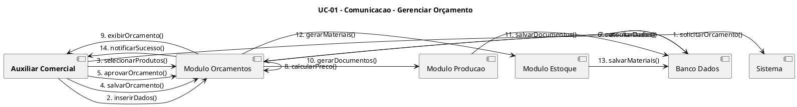

---

## Emitir Relatórios de Obra:

```plantuml
@startuml
title UC-02 - Comunicacao - Emitir Relatórios de Obra

[**Auxiliar Comercial**] -> [Sistema]: 1. acessarObra()
[**Auxiliar Comercial**] -> [Modulo Obras]: 2. solicitarRelatorios()

[Modulo Obras] -> [Banco Dados]: 3. buscarDadosObra()
[Banco Dados] -> [Modulo Obras]: 4. retornarDados()

[Modulo Obras] -> [Modulo Producao]: 5. gerarProducao()
[Modulo Producao] -> [Banco Dados]: 6. salvarDocumentos()

[Modulo Obras] -> [Modulo Estoque]: 7. gerarMateriais()
[Modulo Estoque] -> [Banco Dados]: 8. salvarMateriais()

[Modulo Producao] -> [**Almoxarife**]: 9. notificarMateriais()
[**Almoxarife**] -> [Modulo Estoque]: 10. acessarListas()

[Modulo Estoque] -> [Banco Dados]: 11. buscarMateriais()
[Banco Dados] -> [Modulo Estoque]: 12. retornarMateriais()

[Modulo Estoque] -> [**Almoxarife**]: 13. exibirDocumentos()
[**Almoxarife**] -> [Modulo Estoque]: 14. confirmarSeparacao()

[Modulo Obras] -> [**Auxiliar Comercial**]: 15. notificarConclusao()
@enduml
```

---

## Gerenciar Clientes:

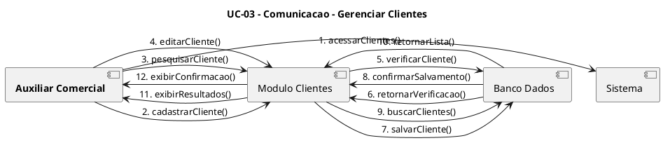

---

## Gerenciar Obras:

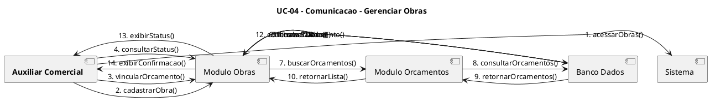

---

## Gerenciar Produtos:

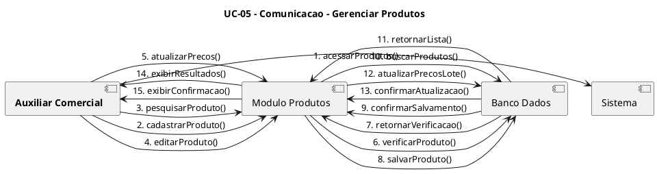

---

## Gerenciar Conta:

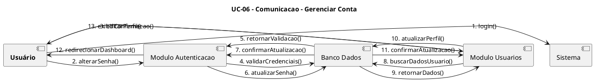

---

## Gerenciar Usuários:

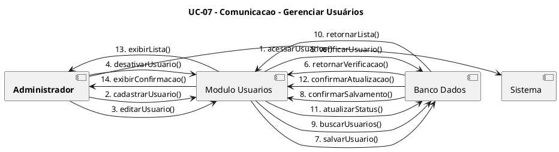

---

## Gerenciar Estoque:

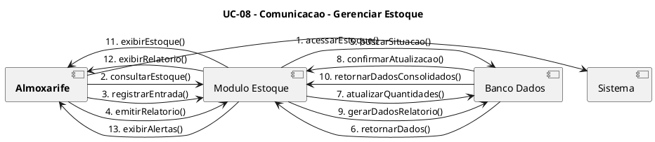

---

## Emitir Relatórios Financeiros:

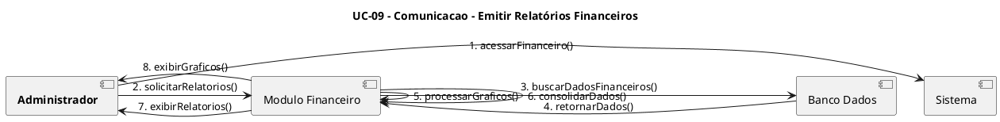

---

## Emitir Relatórios Comerciais:

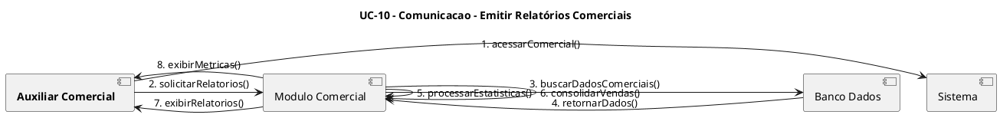

---

## Consultar Estoque:

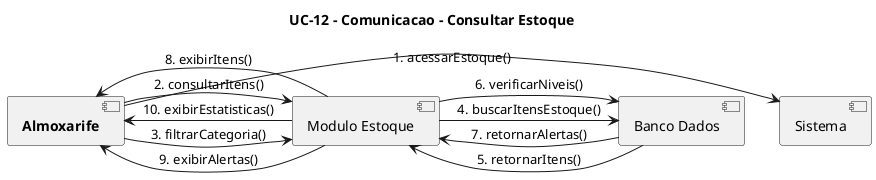

---
