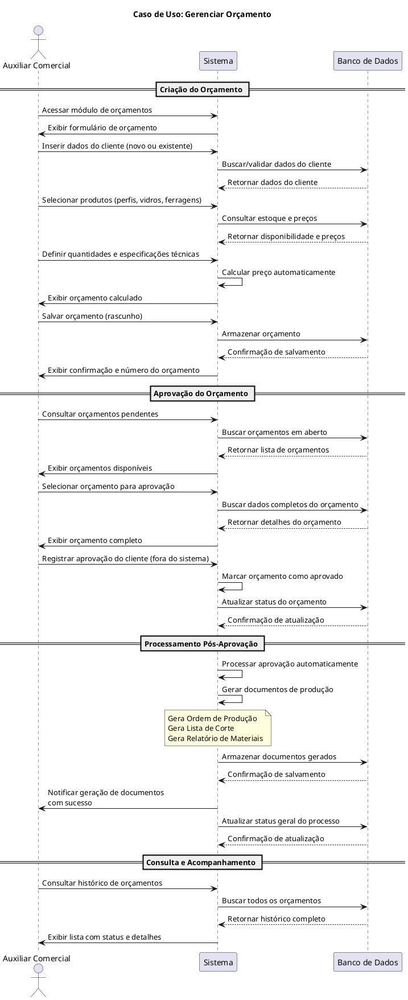
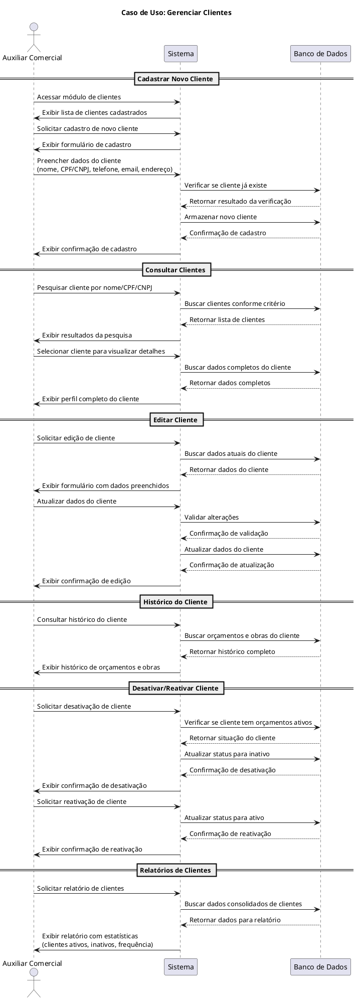

## Gerenciar Orçamento:

```plantuml
@startuml
title Caso de Uso: Gerenciar Orçamento

actor "Auxiliar Comercial" as AC
participant "Sistema" as S
participant "Banco de Dados" as BD

== Criação do Orçamento ==

AC -> S: Acessar módulo de orçamentos
S -> AC: Exibir formulário de orçamento

AC -> S: Inserir dados do cliente (novo ou existente)
S -> BD: Buscar/validar dados do cliente
BD --> S: Retornar dados do cliente

AC -> S: Selecionar produtos (perfis, vidros, ferragens)
S -> BD: Consultar estoque e preços
BD --> S: Retornar disponibilidade e preços

AC -> S: Definir quantidades e especificações técnicas
S -> S: Calcular preço automaticamente
S -> AC: Exibir orçamento calculado

AC -> S: Salvar orçamento (rascunho)
S -> BD: Armazenar orçamento
BD --> S: Confirmação de salvamento
S -> AC: Exibir confirmação e número do orçamento

== Aprovação do Orçamento ==

AC -> S: Consultar orçamentos pendentes
S -> BD: Buscar orçamentos em aberto
BD --> S: Retornar lista de orçamentos
S -> AC: Exibir orçamentos disponíveis

AC -> S: Selecionar orçamento para aprovação
S -> BD: Buscar dados completos do orçamento
BD --> S: Retornar detalhes do orçamento
S -> AC: Exibir orçamento completo

AC -> S: Registrar aprovação do cliente (fora do sistema)
S -> S: Marcar orçamento como aprovado
S -> BD: Atualizar status do orçamento
BD --> S: Confirmação de atualização

== Processamento Pós-Aprovação ==

S -> S: Processar aprovação automaticamente
S -> S: Gerar documentos de produção
note over S: Gera Ordem de Produção\nGera Lista de Corte\nGera Relatório de Materiais

S -> BD: Armazenar documentos gerados
BD --> S: Confirmação de salvamento

S -> AC: Notificar geração de documentos\ncom sucesso
S -> BD: Atualizar status geral do processo
BD --> S: Confirmação de atualização

== Consulta e Acompanhamento ==

AC -> S: Consultar histórico de orçamentos
S -> BD: Buscar todos os orçamentos
BD --> S: Retornar histórico completo
S -> AC: Exibir lista com status e detalhes
@enduml
```

---

## Gerenciar Clientes:

```plantuml
@startuml
title Caso de Uso: Gerenciar Clientes

actor "Auxiliar Comercial" as AC
participant "Sistema" as S
participant "Banco de Dados" as BD

== Cadastrar Novo Cliente ==

AC -> S: Acessar módulo de clientes
S -> AC: Exibir lista de clientes cadastrados

AC -> S: Solicitar cadastro de novo cliente
S -> AC: Exibir formulário de cadastro

AC -> S: Preencher dados do cliente\n(nome, CPF/CNPJ, telefone, email, endereço)
S -> BD: Verificar se cliente já existe
BD --> S: Retornar resultado da verificação

S -> BD: Armazenar novo cliente
BD --> S: Confirmação de cadastro
S -> AC: Exibir confirmação de cadastro

== Consultar Clientes ==

AC -> S: Pesquisar cliente por nome/CPF/CNPJ
S -> BD: Buscar clientes conforme critério
BD --> S: Retornar lista de clientes
S -> AC: Exibir resultados da pesquisa

AC -> S: Selecionar cliente para visualizar detalhes
S -> BD: Buscar dados completos do cliente
BD --> S: Retornar dados completos
S -> AC: Exibir perfil completo do cliente

== Editar Cliente ==

AC -> S: Solicitar edição de cliente
S -> BD: Buscar dados atuais do cliente
BD --> S: Retornar dados do cliente
S -> AC: Exibir formulário com dados preenchidos

AC -> S: Atualizar dados do cliente
S -> BD: Validar alterações
BD --> S: Confirmação de validação
S -> BD: Atualizar dados do cliente
BD --> S: Confirmação de atualização
S -> AC: Exibir confirmação de edição

== Histórico do Cliente ==

AC -> S: Consultar histórico do cliente
S -> BD: Buscar orçamentos e obras do cliente
BD --> S: Retornar histórico completo
S -> AC: Exibir histórico de orçamentos e obras

== Desativar/Reativar Cliente ==

AC -> S: Solicitar desativação de cliente
S -> BD: Verificar se cliente tem orçamentos ativos
BD --> S: Retornar situação do cliente
S -> BD: Atualizar status para inativo
BD --> S: Confirmação de desativação
S -> AC: Exibir confirmação de desativação

AC -> S: Solicitar reativação de cliente
S -> BD: Atualizar status para ativo
BD --> S: Confirmação de reativação
S -> AC: Exibir confirmação de reativação

== Relatórios de Clientes ==

AC -> S: Solicitar relatório de clientes
S -> BD: Buscar dados consolidados de clientes
BD --> S: Retornar dados para relatório
S -> AC: Exibir relatório com estatísticas\n(clientes ativos, inativos, frequência)
@enduml
```
---
